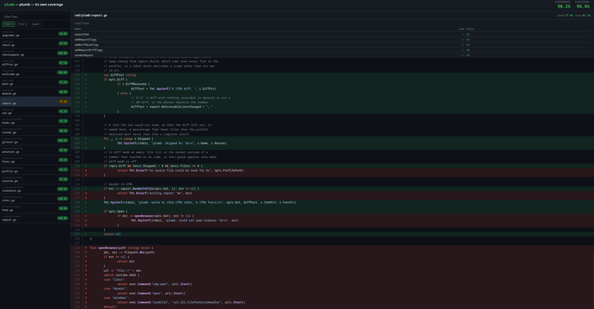

# plumb

> Diff coverage for Go. No service, no token, no stored artifacts.

[](https://github.com/z3le/plumb/actions/workflows/ci.yml)
[](https://pkg.go.dev/github.com/z3le/plumb/cmd/plumb)
[](https://goreportcard.com/report/github.com/z3le/plumb)
[](https://z3le.github.io/plumb/)
[](LICENSE)

`plumb` measures the coverage of the lines your change touched, fails the build
when that number is too low, and renders the whole profile as a single HTML file
you can open.

[](https://z3le.github.io/plumb/)

**[Open the live report →](https://z3le.github.io/plumb/)** — that page is
plumb's own coverage, regenerated on every push.

## Why another coverage tool

Every other diff coverage tool for Go compares your profile against a base
profile that an earlier build saved somewhere. That means a storage backend, an
upload step, and an expiry date:

| Tool | Needs |
| :--- | :--- |
| Codecov, Coveralls | An account, an API token, and a network call |
| `go-coverage-report` | A base profile in an artifact, which expires after 90 days |
| `octocov` | A datastore — S3, GCS, BigQuery, or a report repository |

`plumb` reads your git history instead. It finds the merge base, asks git which
lines changed since then, and intersects them with the profile you just
produced. Nothing is uploaded, nothing is stored, and nothing expires.

```sh
plumb check --min-diff 90
```

That command needs a git repository and a coverage profile. It needs nothing
else.

## Install

```sh
go install github.com/z3le/plumb/cmd/plumb@latest
```

Requires Go 1.25.0 or later.

## Gate a build

`plumb check` fails a build when coverage falls below a number you choose.

```sh
plumb check coverage.out --min-statements 80
```

It exits 0 when every threshold is met and 3 when one is not. The failure line
names the actual value, the required value, and the flag that failed:

```
plumb: statement coverage 79.9%, need 80.0% (--min-statements)
```

`--min-statements` reads the profile and nothing else, so it also works on a
profile downloaded as a build artifact. `--min-functions` adds a second bar and
reads your source files, so run it in the repository the profile came from.
`--min-diff` gates the changed lines.

Paste these steps into a job in your GitHub Actions workflow:

```yaml
      - uses: actions/checkout@v4
        with:
          fetch-depth: 0   # a shallow clone has no merge base for --min-diff to compute against
      - run: go test -coverprofile=coverage.out ./...
      - run: go run github.com/z3le/plumb/cmd/plumb@latest check coverage.out --min-statements 80 --min-diff 90
```

`fetch-depth: 0` matters even if you gate on `--min-statements` alone today:
`actions/checkout@v4` defaults to a depth of 1, which leaves
`refs/remotes/origin/HEAD` unset and the fallback branches absent, so
`--min-diff`'s default reference has nothing to resolve against on your very
first pull request.

There is no install step and no version to go stale.

## Comment on a pull request

`--format=markdown` prints the result as a markdown table. Pipe it into a
comment:

```sh
plumb check coverage.out --min-statements 80 --min-diff 90 --format=markdown \
  | gh pr comment "$PR_NUMBER" -F -
```

The comment looks like this:

> **Coverage**
>
> | Metric | Coverage | Minimum | Status |
> | :--- | ---: | ---: | :---: |
> | Statements | 89.5% | 80.0% | ✅ pass |
> | Diff | 92.3% | 90.0% | ✅ pass |
>
> Diff measured against `origin/master`, merge base `25de3cd`.

The exit code still carries the verdict, so a gate never has to parse the table.
`--format` changes stdout only: the failure lines and the skipped files stay on
stderr, where a build log keeps them. The document opens with a
`<!-- plumb-coverage -->` marker, so a sticky-comment action can replace the
previous comment instead of adding a second one.

## Diff coverage

```sh
plumb check --min-diff 90
```

Run the same measurement locally, with a report to look at:

```sh
plumb run --diff --open
```

To print the number without gating on it, use a floor of 0:

```sh
plumb check --min-diff 0
```

Diff coverage counts lines, not statements — `--min-statements` and
`--min-functions` above count statements, the way `go tool cover -func` does.
A line is the unit a reviewer expects, and it is what `diff-cover` and
Codecov report.

With no `--diff-base`, `plumb` reads the reference git itself recorded
(`refs/remotes/origin/HEAD`) first. When that is not set, it tries
`origin/main`, `origin/master`, `main`, and `master`, in that order, and uses
the first one that resolves. `plumb` prints the reference it chose, so you
never have to guess which branch a number describes.

A new file must be `git add`-ed before any diff can see it — `git diff` never
reports an untracked file, so a brand-new file is silently absent from the
percentage until you stage it.

## Render a report

`plumb run` runs your tests, collects coverage, and writes the report in one
command.

```sh
plumb run --open
```

`plumb run` writes the profile to `.plumb/coverage.out` and the report to
`coverage.html`. The `--open` flag opens the report in your browser.

If you already have a coverage profile, pass it to `plumb report` instead.

```sh
go test -coverprofile=coverage.out ./...
plumb report coverage.out --open
```

`plumb run` passes every argument after `--` to `go test` unchanged.

```sh
plumb run ./internal/... -- -race -count=1
```

### What the report shows

`go tool cover -html` works, but it has no dark mode, no file filter, no sort,
and no function coverage. The plumb report adds them:

- File list sortable by statement %, function %, or name
- Line-by-line source view with green/red coverage highlighting
- Syntax highlighting
- Hit counts per line
- Per-function call counts with ×N badges
- Summary bar: Statements % and Functions %
- Dark mode via `prefers-color-scheme`
- Single self-contained HTML file — no external requests

## Commands

```
  run      Run tests with coverage and render the report
  report   Render a coverage profile as an HTML report
  check    Check coverage against a minimum threshold
  version  Print the plumb version
  help     Show this help text
```

## Flags

```
plumb run [flags] [pattern] [-- go test args]

  --open           open report in browser after writing
  --out file       output HTML file (default: coverage.html)
  --title str      report title (default: module name)
  --diff           report coverage on lines changed since --diff-base
  --diff-base ref  git reference to diff against (default: merge base with the default branch)
```

The pattern defaults to `./...`. A failing test run prints the failure, exits
non-zero, and writes no report.

```
plumb report [flags] [profile]

  --open           open report in browser after writing
  --out file       output HTML file (default: coverage.html)
  --title str      report title (default: module name)
  --diff           report coverage on lines changed since --diff-base
  --diff-base ref  git reference to diff against (default: merge base with the default branch)
```

```
plumb check [flags] [profile]

  --min-statements n   minimum statement coverage percent
  --min-functions n    minimum function coverage percent (reads the source tree)
  --min-diff n         minimum diff coverage percent (lines changed since --diff-base)
  --diff-base ref      git reference to diff against (default: merge base with the default branch)
  --format str         output format: text or markdown (default: text)
```

The profile defaults to `.plumb/coverage.out`. A missed threshold exits 3.

Every command accepts a flag before or after the file name. These two commands
do the same thing:

```sh
plumb report --out report.html coverage.out
plumb report coverage.out --out report.html
```

## Exit codes

| Code | Meaning |
| :--- | :--- |
| 0 | The command succeeded, or the caller asked for help |
| 1 | The command failed |
| 2 | The caller called the command wrong |
| 3 | Coverage fell below a threshold |

A pipeline reads 2 as "called wrong" and 3 as "coverage fell".

## Documentation

- [Architecture](docs/ARCHITECTURE.md) — how the pieces of `plumb` fit together
- [Getting Started](docs/GETTING-STARTED.md) — install `plumb` and produce your first report
- [Development](docs/DEVELOPMENT.md) — build, lint, and work on `plumb` itself
- [Testing](docs/TESTING.md) — run and write tests for `plumb`
- [Configuration](docs/CONFIGURATION.md) — every flag, its default, and the exit codes
- [Deployment](docs/DEPLOYMENT.md) — use `plumb` in CI
- [Contributing](CONTRIBUTING.md) — how to submit a change

## Stability

`plumb` is at 0.x. The commands and the flags above work and are tested, but a
0.x release can still rename one. The [CHANGELOG](CHANGELOG.md) records every
change.

## License

MIT
