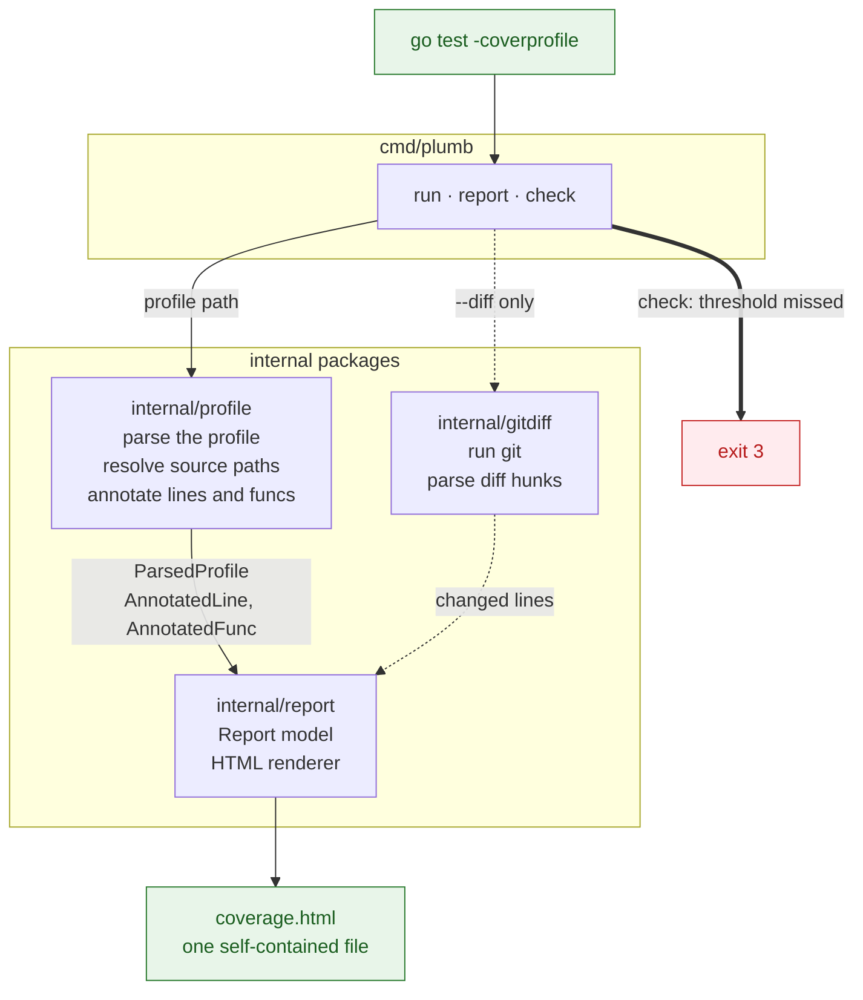

<!-- generated-by: gsd-doc-writer -->
# Architecture

## System overview

`plumb` is a Go command-line tool. It reads a Go coverage profile,
resolves each profiled file back to its source on disk, computes
statement, function, and (optionally) diff coverage, and renders the
result as one self-contained HTML report. A companion command reads
the same profile and exits with a non-zero code when coverage falls
below a threshold you set, so a build can gate on the result.

The three top-level commands are:

- `plumb run` — runs `go test` with coverage, then renders the report.
- `plumb report` — renders an existing coverage profile as HTML.
- `plumb check` — reads a profile and fails the build when coverage
  does not meet a minimum you give it.

All three commands, plus `version` and `help`, are registered in
`cmd/plumb/main.go`.

## Component diagram

A solid arrow is the path every report takes. A dotted arrow is the
diff overlay, which runs only when you pass `--diff` or `--min-diff`.

`internal/gittest` is not part of the runtime pipeline. It is a test
helper package that builds throwaway git repositories for
`cmd/plumb`'s and `internal/gitdiff`'s own tests.

## Data flow

The real pipeline, from profile to HTML, follows one path shared by
`plumb run` and `plumb report`:

1. **Entry.** `plumb run` (`cmd/plumb/run.go`) runs `go test
   -coverpkg=<pattern> -coverprofile=.plumb/coverage.out <pattern>`
   and, on a zero exit, calls the same render path `plumb report`
   uses. `plumb report` (`cmd/plumb/report.go`) reads an existing
   profile path directly, or `.plumb/coverage.out` when none is
   given. Both commands funnel into `renderReport` in
   `cmd/plumb/report.go`.

2. **Module resolution.** `resolveModule` (`cmd/plumb/module.go`)
   walks up from the working directory to find `go.mod`, then reads
   the module path from it, using `internal/profile.FindGoMod` and
   `internal/profile.ReadModulePath`. Every later step that turns a
   profile file name back into a path on disk needs this module path
   and module root.

3. **Profile parsing.** `internal/profile.Parse` (`profile.go`) reads
   the `.coverprofile` file with `golang.org/x/tools/cover`, drops
   `_test.go` entries, and returns one `ParsedProfile` per source
   file. Each `ParsedProfile` carries the file's import-path-style
   name (e.g. `github.com/z3le/plumb/internal/report/html.go`) and
   its parsed `cover.Profile` blocks.

4. **Path resolution.** `internal/profile.ResolveSafe`
   (`internal/profile/profile.go`) maps a profile file name back to a
   path on disk under the module root, and refuses a path that
   resolves outside it — the profile is treated as an
   externally-supplied input, since a build can download it as an
   artifact separate from the source tree.

5. **Per-line and per-function annotation.**
   `internal/profile.Annotate` (`annotate.go`) reads the source file
   and marks every line `Covered`, `Uncovered`, or `Uncoverable`
   based on the profile's blocks. `internal/profile.WalkFuncs`
   (`funcs.go`) parses the same file with `go/parser` and returns one
   `AnnotatedFunc` per function declaration, with a call count taken
   from the block that starts inside its body. `internal/profile/stats.go`
   sums these into statement and function totals
   (`StmtTotals`, `StmtTotalsAll`, `FuncPct`).

6. **Optional diff overlay.** When `--diff` or `--diff-base` is set,
   `diffCoverage` (`cmd/plumb/diffcov.go`) asks `internal/gitdiff` for
   the lines a change actually touched: `gitdiff.NewRunner` finds the
   git binary, `Runner.ResolveBase` picks a reference (an explicit
   `--diff-base`, or `origin/HEAD`, `origin/main`, `origin/master`,
   `main`, `master` in that order), `Runner.MergeBase` finds the
   common ancestor with `HEAD`, and `Runner.Diff` reads a
   zero-context unified diff against the working tree.
   `gitdiff.ParseHunks` (`hunks.go`) turns that diff text into a map
   of changed line numbers per file, with no git process and no I/O
   of its own. `diffCoverage` then renames each git-relative path to
   the profile's import-path naming, intersects the changed lines
   with each file's annotated lines through
   `profile.CoverableChanged` — the single implementation both the
   CLI's `--min-diff` number and the HTML report's diff percentage
   call, so the two can never disagree — and records which files it
   had to skip and why (not in the profile, stale relative to the
   profile, or no coverable line among the ones changed).

7. **Report assembly.** `report.Build` (`internal/report/report.go`,
   `internal/report/html.go`) walks every `ParsedProfile`, resolves
   its disk path, reuses annotated lines the diff step already
   produced (or annotates them itself when diff mode is off),
   syntax-highlights each line with `chroma`, and accumulates
   module-wide statement, function, and diff totals into a `Report`
   struct. A file the diff did not touch is dropped from diff-mode
   output; a file that could not be read or highlighted is recorded
   in `Report.Skipped` instead of failing the whole report.

8. **Rendering.** `report.RenderToFile` executes the embedded
   `internal/report/templates/report.html.tmpl` Go template against
   the `Report` struct and writes one self-contained HTML file — CSS,
   syntax highlighting, and data are all inlined, so the output has
   no external dependency and can be opened directly in a browser.
   `plumb run --open` and `plumb report --open` then launch it with
   the OS's default opener (`xdg-open`, `open`, or `rundll32`,
   depending on `runtime.GOOS`).

`plumb check` (`cmd/plumb/check.go`) follows steps 2, 3, 4, 5, and 6
of the same pipeline but never calls `report.Build` or the renderer.
It compares the resulting percentages against the `--min-statements`,
`--min-functions`, and `--min-diff` thresholds it was given, and
returns a coded error when any of them is not met.

## Key abstractions

- `profile.ParsedProfile` (`internal/profile/profile.go`) — a parsed
  coverage profile for one file, pairing its import-path file name
  with the underlying `cover.Profile` blocks. The unit every later
  stage iterates over.
- `profile.AnnotatedLine` and `profile.LineStatus`
  (`internal/profile/annotate.go`) — one source line plus its
  coverage status (`Uncoverable`, `Covered`, `Uncovered`, `Partial`)
  and hit count. Produced by `profile.Annotate`.
- `profile.AnnotatedFunc` (`internal/profile/funcs.go`) — one function
  declaration plus its call count, produced by `profile.WalkFuncs` by
  parsing the source file's AST.
- `profile.CoverableChanged` (`internal/profile/annotate.go`) — the
  one function that turns a set of changed line numbers plus
  annotated lines into a covered/total pair. Both the CLI's
  `--min-diff` path (`cmd/plumb/diffcov.go`) and the HTML report's
  diff percentage (`internal/report/html.go`) call it, so the two
  numbers can never drift apart.
- `report.Report` and `report.BuildOptions`
  (`internal/report/report.go`) — the data model passed into the HTML
  template, and the options `report.Build` reads to construct it.
- `gitdiff.Runner` (`internal/gitdiff/runner.go`) — wraps the `git`
  binary for one working directory: `RepoRoot`, `ResolveBase`,
  `MergeBase`, `Diff`, `Verify`, `IsShallow`, `RemoteHead`.
- `gitdiff.ParseHunks` (`internal/gitdiff/hunks.go`) — a pure function
  that turns `git diff --unified=0` output into a map of file name to
  changed line numbers. It runs no git command itself, so its hunk
  grammar can be tested against fixture text alone.
- `exitError` (`cmd/plumb/exitcode.go`) — an error that carries a
  process exit code. A command that returns one has already written
  its own message to stderr, so `dispatch` in `main.go` returns the
  code without printing anything further.

## Exit code scheme

`cmd/plumb/main.go`'s `dispatch` function defines the exit code
contract every command follows, documented in `cmd/plumb/exitcode.go`
and `main.go`:

| Code | Meaning |
|------|---------|
| 0 | The command succeeded, or the caller asked for help (`-h`, `--help`, or the `help` command). |
| 1 | The command returned an ordinary error, including a profile that measures no coverable statement. |
| 2 | A usage error: no argument, an unknown command, an unknown flag, a flag value the command cannot read, an unexpected second positional argument, or a threshold outside 0 to 100. |
| 3 | A coded error for a coverage threshold the profile did not meet. |

A command that wants exit codes 2 or 3 returns an `*exitError`
(`cmd/plumb/exitcode.go`), built with `newExitError(code, msg)`.
`dispatch` reads the code through `errors.As` — so a wrapped
`*exitError` still resolves — and, because a coded error means the
command already printed its own report to stderr, prints nothing
further itself. This is the same rule `dispatch` already applies to
`flag.ErrHelp`: a command's own `flag.FlagSet` writes its usage block
once, during parsing, and `dispatch` must not print it a second time.

## Flag-order handling

Go's standard `flag.Parse` stops reading flags at the first
non-flag argument, so it cannot parse a call like
`plumb check coverage.out --min-statements 80`, where a flag follows
a positional argument — a form the help text and README document.
`cmd/plumb/argorder.go` fixes this in two parts:

- `reorderArgs(fs, args)` walks the raw argument list once and moves
  every flag token — and the value token it consumes, when the flag
  is not boolean — ahead of every positional argument, stopping the
  scan at a bare `--` terminator (whose remaining tokens stay
  positional and untouched, matching `flag.Parse`'s own rule for
  `--`). It looks up each flag's registration to tell a boolean flag,
  which takes no value, from one that does.
- `parseFlags(fs, args)` calls `reorderArgs` and then `fs.Parse`.
  Every command (`run`, `report`, `check`) calls `parseFlags` rather
  than `fs.Parse` directly, so a flag placed after a positional
  argument is never silently dropped. A parse error is wrapped in a
  coded `*exitError` with code 2 — the flag package already wrote its
  own message and usage block to the command's stderr during parsing,
  so `dispatch` must print nothing more.

`cmd/plumb/argorder.go` also defines `flagsGiven(fs)`, which uses
`fs.Visit` to report only the flags the caller actually typed. This
lets `check` and `report` tell "flag not given" apart from "flag
given its zero value" — needed because `plumb check` treats
`--diff-base` alone, with no `--min-diff`, as a request for diff mode,
and because `check` must reject a threshold typed as the same value
as its own unset default.

## Directory structure rationale

| Directory | What it owns |
|-----------|--------------|
| `cmd/plumb/` | The CLI: command dispatch, flag parsing, and the `run` / `report` / `check` implementations. |
| `internal/profile/` | Coverage profile parsing, source path resolution, and per-line and per-function annotation. It knows nothing about git or HTML. |
| `internal/report/` | The `Report` data model and the HTML renderer, with the embedded template in `internal/report/templates/`. |
| `internal/gitdiff/` | Git diff hunk parsing (pure) and a `Runner` that wraps the git binary for one working directory. |
| `internal/gittest/` | A test-only helper that builds throwaway git repositories for the tests in `cmd/plumb` and `internal/gitdiff`. |
| `testdata/` | Fixture Go source files that the report and profile tests read. |

Each `internal/` package owns one concern and knows nothing about the
others' internals: `internal/profile` never imports `internal/report`
or `internal/gitdiff`; `internal/gitdiff` never imports
`internal/profile` or `internal/report`. `cmd/plumb` is the only
package that imports all three and wires them together, which keeps
the coverage-parsing logic reusable independent of both git and HTML
rendering.
